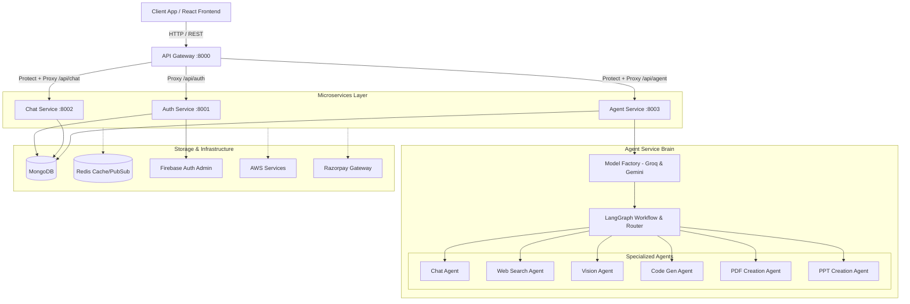
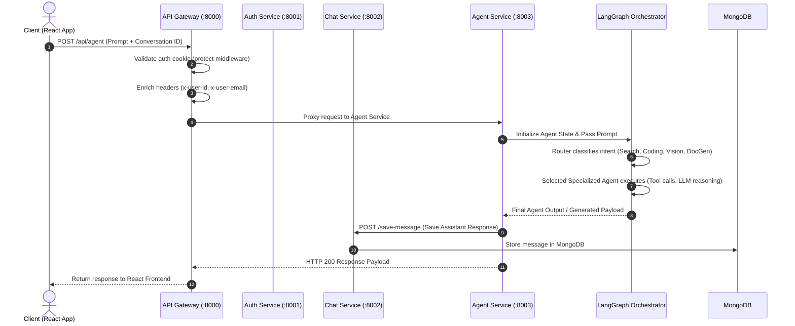

# VortexAi 🌪️

VortexAi is an advanced, microservices-driven **Multi-Agent AI Ecosystem**. It leverages **LangChain**, **LangGraph**, and **RAG** architectures to route user requests intelligently to specialized AI agents (Chat, Web Search, Code Generation, PDF/PPT Creation, Vision Analysis). The application is built on a modern MERN stack architecture with Redis, Firebase Auth, Docker, AWS, and Razorpay integration.

---

## 🏗️ System Architecture

VortexAi follows a distributed microservices pattern behind a centralized **API Gateway**. The gateway handles request routing, authentication validation, and header propagation before forwarding traffic to specialized downstream microservices.



---

## 🧩 Microservices Breakdown

### 1. API Gateway (`backend/gateway`) — **Port 8000**
The single entry point for all frontend client traffic.
* **JWT & Auth Verification**: Uses `protect` middleware to verify session tokens/cookies via Firebase Admin.
* **Header Enrichment (`proxyWithHeader`)**: Extracts authenticated user details and injects custom headers (`x-user-id`, `x-user-email`) into proxied requests so downstream services remain stateless.
* **Proxied Routes**:
  * `/api/auth` $\rightarrow$ Auth Service (`:8001`)
  * `/api/chat` $\rightarrow$ Chat Service (`:8002`) (Protected)
  * `/api/agent` $\rightarrow$ Agent Service (`:8003`) (Protected)
  * `/api/me` $\rightarrow$ Get current authenticated user profile

### 2. Auth Service (`backend/services/auth`) — **Port 8001**
Manages user identity and authentication lifecycle.
* Integrates with **Firebase Admin SDK** for Google Authentication and token verification.
* Maintains user documents in MongoDB (credits, profiles, metadata).
* Sets secure, HTTP-only authentication cookies for seamless session management.

### 3. Chat Service (`backend/services/chat`) — **Port 8002**
Handles persistent storage and management of conversations and message histories.
* **Database Schemas**: `Conversation` (title, user reference, timestamp) and `Message` (conversationId, role, content).
* **API Endpoints**:
  * `GET /create-conversation`: Initializes a new user chat thread.
  * `GET /get-conversations`: Retrieves all active user conversations.
  * `POST /update-conversation`: Modifies conversation titles and properties.
  * `POST /save-message`: Persists incoming user messages or AI agent responses.
  * `GET /get-messages/:conversationId`: Fetches ordered message history for a given conversation.

### 4. Agent Service (`backend/services/agent`) — **Port 8003**
The dedicated AI orchestration brain isolating high-latency LLM tasks from core CRUD operations.
* **Multi-Model Strategy (`config/lllmModels.js`)**: Implements a Model Factory pattern exposing:
  * **Groq (`ChatGroq`)**: Ultra-low latency open-source models (e.g., Llama 3) for fast responses.
  * **Google Gemini (`ChatGoogleGenerativeAI`)**: Advanced reasoning, large context window handling, and multimodal inputs via `@langchain/google-genai`.
* **Stateful LangGraph Workflow (`graph/`)**:
  * `state.js`: Defines channels and persistent execution state.
  * `router.js`: Dynamic intent router classifying requests to select the best agent.
  * `graph.js`: Compiles cyclic graph state machine where agents can loop, invoke tools, observe feedback, and finalize answers.
* **Specialized Agent Modules (`agents/`)**:
  * `chat.agent.js`: General conversation handling.
  * `search.agent.js`: Real-time web search and RAG data retrieval.
  * `vision.agent.js`: Multimodal image interpretation and visual Q&A.
  * `coding.agent.js`: Code generation, refactoring, and code review.
  * `pdf.agent.js`: Document parsing and automated PDF report generation.
  * `ppt.agent.js`: Presentation deck structure and slide generation.

---

## 🔄 End-to-End Workflow



1. **Client Action**: User submits a message/prompt from the React frontend.
2. **Gateway Interception**: The API Gateway intercepts the request, verifies authentication tokens using `protect` middleware, and appends `x-user-id` to downstream headers.
3. **Service Dispatch**: Gateway proxies the payload to the `agent` service (`/api/agent`).
4. **Intent Routing**: The `agent` service feeds the prompt into the **LangGraph Orchestrator**, where the router evaluates intent and delegates work to the appropriate agent (`search`, `coding`, `vision`, `pdf`, `ppt`, or `chat`).
5. **Agent Execution & Tools**: The targeted agent calls the LLM (Groq or Gemini) and executes any necessary external tools or RAG pipelines.
6. **State & History Persistence**: Results are written back to the `chat` service via internal API calls to persist messages under the user's `conversationId` in MongoDB.
7. **Response Delivery**: The formatted answer is sent back through the gateway to update the React client UI in real time.

---

## 📁 Repository Structure

```text
VortexAi/
├── backend/
│   ├── gateway/                 # API Gateway Service (:8000)
│   │   ├── controller/          # User & Auth Controllers
│   │   ├── middleware/          # Authentication verification middleware
│   │   ├── utils/               # Proxy with header enrichment utilities
│   │   └── index.js             # Gateway entry point & route registration
│   └── services/
│       ├── agent/               # AI Agent Service (:8003)
│       │   ├── agents/          # Specialized agent implementations (chat, search, vision, coding, pdf, ppt)
│       │   ├── config/          # DB connection & multi-model LLM factory (Groq, Gemini)
│       │   ├── graph/           # LangGraph state management, graph definition & router
│       │   ├── AGENT_FLOW_AND_ARCHITECTURE.md
│       │   └── index.js         # Agent service entry point
│       ├── auth/                # User Authentication Service (:8001)
│       │   ├── config/          # Firebase Admin & MongoDB setup
│       │   ├── controllers/     # Authentication & user profile handlers
│       │   ├── models/          # User database schemas
│       │   ├── routes/          # Auth service endpoints
│       │   └── index.js         # Auth service entry point
│       └── chat/                # Conversation & Messaging Service (:8002)
│           ├── config/          # Database connection
│           ├── controllers/     # Conversation & message controllers
│           ├── models/          # Mongoose schemas (Conversation, Message)
│           ├── routes/          # Chat routes (/create-conversation, /save-message, etc.)
│           └── index.js         # Chat service entry point
└── README.md                    # System documentation & setup guide
```

---

## 🛠️ Port Mappings & Environment Variables

| Service | Protocol / Port | Role / Endpoint Prefix |
| :--- | :--- | :--- |
| **API Gateway** | `HTTP: 8000` | Main entry point (`/api/auth`, `/api/chat`, `/api/agent`, `/api/me`) |
| **Auth Service** | `HTTP: 8001` | User registration & Firebase authentication (`/`) |
| **Chat Service** | `HTTP: 8002` | Conversation and message persistence (`/`) |
| **Agent Service** | `HTTP: 8003` | LangGraph AI agent orchestration (`/`) |

### Key Environment Variables (`.env`)
Each microservice maintains its own isolated `.env` configuration:
* **Gateway**: `PORT=8000`, `FRONTEND_URL`, `AUTH_SERVICE`, `CHAT_SERVICE`, `AGENT_SERVICE`.
* **Auth Service**: `PORT=8001`, `MONGODB_URI`, Firebase Admin service account keys.
* **Chat Service**: `PORT=8002`, `MONGODB_URI`.
* **Agent Service**: `PORT=8003`, `MONGODB_URI`, `GROQ_API_KEY`, `GOOGLE_API_KEY`.

---

## 🚀 Getting Started

### Prerequisites
* **Node.js**: v18.x or higher
* **MongoDB**: Local instance or MongoDB Atlas URI
* **API Keys**: Groq API Key and Google Gemini API Key

### Running Microservices Locally

1. **Install Dependencies** in each service directory:
   ```bash
   cd backend/gateway && npm install
   cd ../services/auth && npm install
   cd ../services/chat && npm install
   cd ../services/agent && npm install
   ```

2. **Start Services** (in separate terminal windows or process manager):
   ```bash
   # Start API Gateway
   cd backend/gateway && npm run dev

   # Start Auth Service
   cd backend/services/auth && npm run dev

   # Start Chat Service
   cd backend/services/chat && npm run dev

   # Start Agent Service
   cd backend/services/agent && npm run dev
   ```
