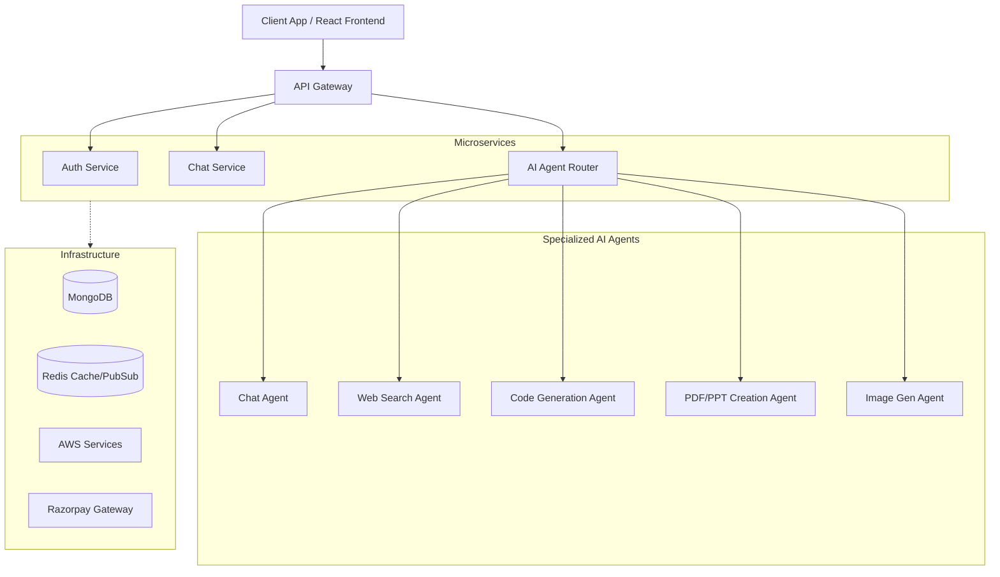

# VortexAi 🌪️

VortexAi is an advanced, microservices-driven Multi-Agent AI ecosystem. It leverages LangChain, LangGraph, and RAG to route queries to specialized agents (Chat, Web Search, Code Generation, PDF/PPT Creation, Image Gen). Built on the MERN stack with Redis, Docker, AWS, and Razorpay integration for credit-based usage.

## 🏗️ Architecture & Structure

### Key Components:
* **Frontend:** React application built with Vite, utilizing Redux for state management and Tailwind CSS for styling.
* **Backend (Microservices):**
  * **API Gateway:** Central entry point handling routing, CORS, and proxying requests to internal services.
  * **Auth Service:** Manages user authentication (Firebase), registration, and sessions.
  * **Chat Service:** Handles real-time conversation state and history.
* **AI Ecosystem:** Utilizing LangChain, LangGraph, and RAG architectures to route user queries intelligently to the appropriate agent.
* **Infrastructure:** 
  * **MongoDB:** Primary database for storing users, conversations, and agent metadata.
  * **Redis:** Caching and Pub/Sub mechanism for real-time capabilities.
  * **Docker & AWS:** Containerized deployment for scalable cloud hosting.
  * **Razorpay:** Payment integration for credit-based API usage limits.

## 🚀 Getting Started

*(Further instructions on local setup, Docker deployment, and environment variables will be added here as the project evolves.)*
